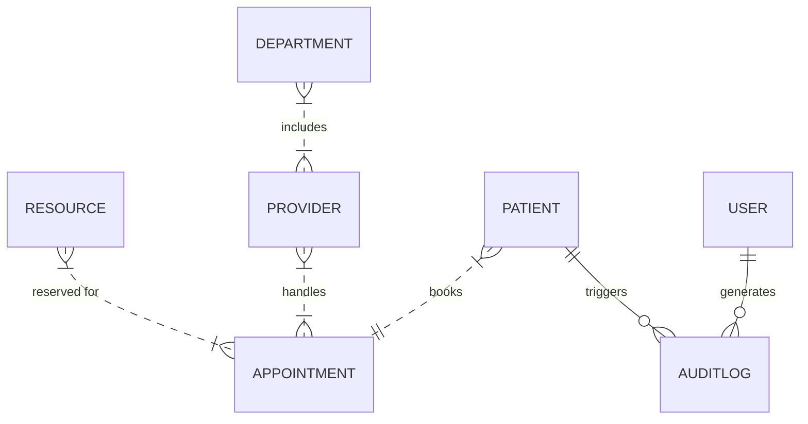
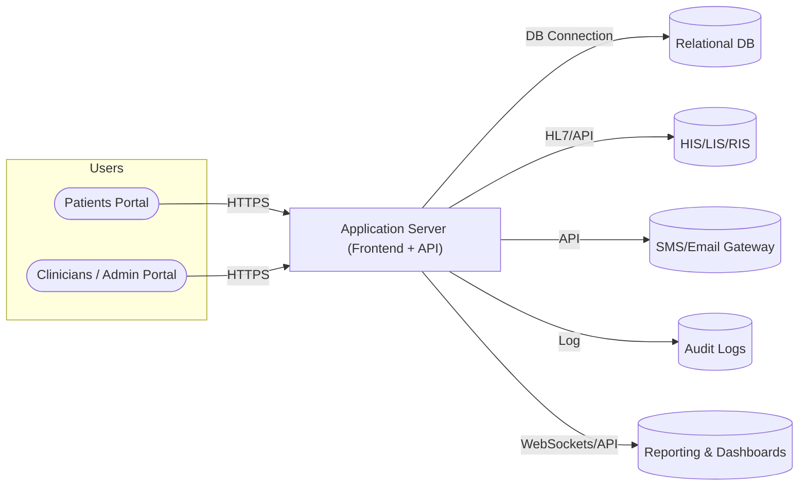

# Executive Summary

Aminu Kano Teaching Hospital (AKTH) is a 500-bed federal tertiary hospital in Kano State, Nigeria, serving as a regional referral and teaching centre.  It handles a very large patient volume (e.g. ~194,000 outpatients in 2006) with multiple specialty clinics and support services.  AKTH faces challenges common to tertiary hospitals: long queues, high patient loads, and inefficient manual appointment processes.  Studies note that requiring patients to physically visit hospitals to book appointments causes inefficiency, inconvenience, and patient dissatisfaction.  Introducing a **web-based Hospital Appointment Booking System (HABS)** will allow remote scheduling, reduce wait times, and optimise resource utilisation while maintaining quality of care.

This requirements document outlines the scope, objectives, stakeholders, and detailed functional and non-functional requirements for HABS at AKTH. It specifies the data model, technology stack options, deployment and integration strategy, and other operational considerations.  Security and privacy (in line with Nigeria’s NDPA 2023 and HIPAA-like best practices) are emphasised throughout.  Diagrams show the key entities (ER diagram) and an example deployment architecture.  Estimated effort, costs and timelines are provided in broad ranges (Low/Medium/High) for planning.

## Project Scope and Objectives

- **Scope:** Develop and deploy a web-based appointment scheduling and management system for AKTH outpatients and clinicians.  The system will support patient self-registration and appointment booking (online or via kiosk), clinician/professional scheduling, and administrative oversight.  It will integrate with existing hospital systems where available (e.g. HIS, lab/pharmacy).  Initially focus on core outpatient clinics, with modular provisions for future expansion (e.g. telehealth).
- **Objectives:** Improve patient access and satisfaction, reduce wait times, and optimise clinic throughput. Automate appointment workflows (booking, reschedule, cancellation, reminders, waitlists) and reporting. Ensure data security and compliance with Nigeria’s data laws. Provide dashboards for administrators to monitor operations. Support multilingual UI (English and Hausa) for patient usability.

## Stakeholders and User Roles

- **Patients (and families):** End users booking appointments, viewing schedules, receiving reminders. Roles include self-registered patients or walk-ins, possibly with proxies (for children/elderly).
- **Clinicians/Providers:** Doctors, nurses and allied health staff. They set availability, confirm/reschedule appointments, view patient lists, and see own schedules. They may adjust triage/priorities.
- **Administrative Staff (Front-desk/Reception):** Manage patient registrations, oversee bookings, handle cancellations, and administer the schedule (e.g. add walk-in slots, update availability).
- **IT/System Administrators:** Install, configure, maintain the system (servers, database, security). Manage user accounts and roles, backup/restore, and perform system upgrades.
- **Hospital Management:** Executives (e.g. medical director) and clinic managers who need reports, dashboards and audit logs for performance monitoring, decision-making and compliance.
- **Third-Party Services:**  
  - **Government/Regulatory Bodies:** Ensure compliance with NDPA/NDPR, National Health Act, etc. (system must generate any required audit/trail for audits).  
  - **External Systems:** Integration partners like **HIS/EHR, LIS (lab), RIS (imaging), pharmacy, billing/insurance, SMS and Email gateways, and telehealth platforms** (e.g. video).  
  - **Technical Consultants/Vendors:** May provide support for HIS integration, cloud hosting, or cybersecurity audits.

## Functional Requirements

1. **Patient Registration**: Online self-registration (web portal/mobile) or in-person at hospital. Capture essential demographics (name, DOB, contact, language preference, next-of-kin). Unique Patient ID across modules. Consent capture (see Data/Privacy section below). Patients and staff should link existing records (to avoid duplicates).  
2. **Appointment Booking:**  
   - Patients can search for available slots by department, provider specialty, date/time and hospital location.  Providers and departments have defined schedules (see below).  
   - Book, reschedule, or cancel appointments. Booking logic prevents double-booking of provider time slots and resources (rooms/equipment).  
   - Support different appointment types: in-person, telehealth (with link generation), procedures. Create one Appointment record per meeting.  
   - Multi-Department & Resource Scheduling:  Handle referrals to other departments. Reserve required resources (e.g. specific clinic rooms, equipment) during booking.  
   - Waitlists/Prioritization: When slots are full, allow patients to join a waitlist. Automatically notify if a slot opens. Implement triage logic (e.g. prioritise urgent/referral cases). Provide manual priority override by staff if needed.  
   - Recurring Appointments: Ability to book repeating visits (e.g. weekly therapy).  
3. **Provider Schedules & Availability:** Define each clinician’s working hours (by day/week), break times, special clinics. Administrators can update availability (e.g. holidays, conferences). Generate dynamic time slots per provider.  
4. **Check-In/Kiosk (Optional):** In-clinic kiosk or desk interface for patients to check in on arrival, update status (arrived, no-show). Integration to track actual arrivals vs booked times.  
5. **Notifications & Reminders:** Automated reminders via SMS and/or email (e.g. 24h and 1h before appointment). Support confirmation/cancellation by reply. Handle opt-out preferences.  
6. **Reporting & Dashboards:** Real-time dashboards for clinic managers (today’s schedule, occupancy, waitlist stats). Reports on KPIs (no-show rates, average wait time, utilization) and compliance. Pre-built reports (daily appointments, monthly attendance by department, etc.) and ad-hoc query capability.  
7. **Audit Logging:** Immutable logs of all actions (create/update/delete appointments, user logins, record views). Include who, what, when details. Ensure tamper-proof audit trail as per healthcare best practices.  
8. **User Management & RBAC:** System accounts for patients (self-service portal), providers, staff, and IT/admin users. Role-Based Access Control (RBAC): Patients see only their own data; providers see patients assigned to them; clinic admins see schedules for their units; IT sees system metrics and logs; auditors have view-only access to logs. Enforce strong authentication (see Security).  
9. **Multilingual Support:** User interface and communications must be in **English** and **Hausa** (defaulting to user’s choice). All appointment and reminder content should be localised accordingly to serve Kano’s primarily Hausa-speaking population.

(*Sources:* Online scheduling improves efficiency and satisfaction. Appointment reminders cut no-shows by ~30–50%. HL7 FHIR specifies Appointment semantics for interoperability.)

## Non-Functional Requirements

- **Performance:**  Fast responsiveness (e.g. search & booking <500ms for end-users). Handle thousands of concurrent users (given high patient load) during peak hours.  
- **Scalability:**  Architect for horizontal scaling. Support growth (e.g. more departments, extra clinics). Cloud-friendly design (or scalable on-prem cluster).  
- **Availability:**  24×7 availability (at least 99.9% up-time) given critical patient access. Plan maintenance windows with redundancy/failover.  
- **Security & Privacy:** Comply with Nigeria’s NDPA 2023/NDPR (all health data = sensitive personal data) and adopt HIPAA-like safeguards. Encrypt all Protected Health Information (PHI) at rest (e.g. AES-256) and in transit (TLS 1.3). Maintain strict RBAC and audit trails as above. Implement multi-factor authentication (MFA) for providers/admins, strong password policies. Log all accesses. Ensure data residency or compliant cross-border data transfer.  
- **Regulatory Compliance:** Support legal requirements: data retention (e.g. retain records ≥10 years), data breach notification (72h NDPC rule), consent management (capture explicit patient consent), and data minimisation.  
- **Reliability:** Use fault-tolerant design: database replication, regular backups, automated recovery. Failover support for critical components.  
- **Maintainability:** Modular, well-documented code with CI/CD pipelines. Use widely-supported frameworks. Clear logging/monitoring for troubleshooting.  
- **Usability:** Intuitive UI for patients and staff. Accessible on desktop and mobile. Multi-device support (phones, tablets, kiosks).  
- **Localization:** Date/time/number formats, language translations. Unicode support for names/Hausa.  

(*Sources:* NDPA 2023 classifies health data as sensitive and requires strong controls. Best practices include encryption and audit trails. High availability (~99.9%) is recommended for patient-facing health systems.)

## Data Model & Key Entities

A simplified ER data model includes **Patients, Providers, Departments, Resources, Appointments, Users**, and **AuditLogs**.  Key entities:

| **Entity**     | **Key Attributes**                                 | **Description**                                                 |
|---------------|-----------------------------------------------------|-----------------------------------------------------------------|
| Patient       | PatientID, Name, DOB, Gender, ContactInfo, Language, ConsentStatus | Person receiving care. Demographics, contact, consent.         |
| Provider      | ProviderID, Name, Specialty, DeptID, Schedule       | Clinician or staff. Linked to a department, has schedules.      |
| Department    | DeptID, Name                                        | Hospital department or clinic (e.g. Cardiology, Pediatrics).   |
| Appointment   | ApptID, PatientID, ProviderID, DeptID, StartTime, EndTime, Type (in-person/telehealth), Status | Booking of a service. Tied to one patient, provider, time slot.|
| Resource      | ResourceID, Type (Room/Equipment), Location, Capacity| Physical resource (room, bed, equipment) that can be booked.    |
| User          | UserID, Username, Role (Patient/Staff/Clinician/Admin), LinkedPersonID | System user account for login (could link to Patient or Provider record). |
| AuditLog      | LogID, UserID, Action, EntityType, EntityID, Timestamp, Details | Immutable log of operations (who did what when).                |

*Entities such as `Appointment` and `Provider` align with HL7 FHIR definitions (an Appointment is a booking of a healthcare event). The audit log ensures full traceability.*

## Technical Stack Options

Three sample technology stacks (full-stack frameworks) are compared below. All options support modern web deployment, RESTful APIs, and can meet security requirements. Teams should pick based on existing expertise, local support, and cost.

| **Layer**     | **Stack A** (Java)            | **Stack B** (JavaScript/Node)          | **Stack C** (Python)             |
|--------------|------------------------------|---------------------------------------|----------------------------------|
| **Frontend** | Angular or React (TypeScript) for SPA | React or Vue (JavaScript)           | React or Vue (JS)                |
| **Backend**  | Spring Boot (Java, MVC)      | Node.js + Express or Nest.js (TypeScript/JS) | Django or Flask (Python)        |
| **Database** | PostgreSQL or MySQL (RDBMS)  | PostgreSQL or MongoDB (NoSQL)        | PostgreSQL or MySQL              |
| **Auth**     | JWT/OAuth2, Spring Security  | JWT/OAuth2 (Passport.js or Auth0)    | JWT (PyJWT) / OAuth2 (oauthlib)  |
| **Messaging/Notifications** | RabbitMQ or Apache Kafka (for queuing tasks and events) | Redis Pub/Sub or RabbitMQ        | Celery with Redis/RabbitMQ       |
| **Real-time**| WebSocket (Spring)           | Socket.io or WebSocket               | Django Channels (WebSocket)      |
| **Integrations** | HL7 FHIR libraries (HAPI FHIR for Java) | FHIR SDKs or custom APIs            | FHIR client (FHIR-Parser)       |
| **API docs** | Swagger/OpenAPI             | Swagger (e.g. via Express plugins)   | Swagger (drf-yasg)               |
| **Containerization** | Docker, Kubernetes    | Docker, Kubernetes                   | Docker, Kubernetes               |

Each stack can support encryption (TLS), RBAC, auditing, and scaling. For example, **Stack B (Node/Express + React + PostgreSQL)** is open-source-friendly and widely used, whereas **Stack A (Spring/Angular)** provides enterprise robustness and **Stack C (Django/React)** is rapid for Python-savvy teams. Choices should consider local developer skill, licensing (all above can be fully open-source), and integration libraries (FHIR/HIS).

(*Sources:* Examples of HMS technology use PHP/JavaScript/MySQL; modern design prefers REST, JWT, and WebSockets. HL7 FHIR standards are recommended for interoperability.)

## Deployment and Hosting Options

- **On-Premises:** Install on hospital’s local servers. Offers direct control, data residency, and integration with LAN-based systems (HIS). Requires hospital IT to manage hardware, power, and cooling. Good if AKTH has existing data center and security personnel.
- **Cloud (e.g. AWS, Azure, GCP):** Use cloud IaaS/PaaS. Pros: high availability SLAs, elastic scaling, managed database services, global backups. Cons: possible cross-border data issues (must ensure Nigeria’s data regulations and possibly local cloud region or multi-region).
- **Hybrid:** Critical data (PHI) stored on-prem (private cloud) while using public cloud for non-sensitive parts (or for failover). Provides balance of control and scalability.

| **Option**        | **Pros**                                                 | **Cons**                                               |
|------------------|----------------------------------------------------------|--------------------------------------------------------|
| On-Premises      | Full control, complies with data residency, integrates with local HIS via LAN. Predictable costs (CapEx). | Higher upfront cost, need local infra/staff, potential for downtime without robust redundancy. |
| Public Cloud     | Rapid deployment, high scalability and availability (multi-AZ), pay-as-you-go OpEx. Built-in security features and managed DB. | Recurring costs, need connectivity, must address cross-border compliance (use African data centers or VPN/Compliance frameworks). |
| Hybrid           | Sensitive data kept on-site while using cloud bursting for scale. | Complexity of split deployment, requires network setup and management. |

(*Source:* Cloud adoption is recommended to reduce infra costs and increase scalability. NDPA mandates safeguards for cross-border data.)

**Deployment Architecture (example):**  A flowchart of the system might look like the following, illustrating users, web application, data stores, and integrations:

This highlights that both patients and staff connect to the application server (via browser or mobile), which in turn reads/writes to the database, calls external systems (e.g. HIS or labs via FHIR/HL7), sends notifications through SMS/Email gateways, and logs actions.

## Integration Points

- **Hospital Information System (HIS/EHR):** If AKTH has an HIS, integrate appointment data (and eventually patient data) via HL7/FHIR interfaces or database sync. Allows single source of truth for patient demographics and medical record linkage.  
- **Laboratory/Pharmacy Systems (LIS/RIS):** Interface for ordering labs/imaging or notifying labs of scheduled procedures. Not mandatory for core booking, but beneficial. Can use APIs or file exports.  
- **Billing/NHIS:** Connect to billing/insurance systems to flag attended vs missed appointments for invoicing or claims. Possibly trigger billing events on patient check-in.  
- **SMS/Email Gateway:** Use a local bulk SMS provider (e.g. Termii, TeraBox) or services like Twilio (with Nigeria coverage) to send reminders. Ensure opt-in compliance. Use SMTP or APIs for email.  
- **Payment Gateway (Optional):** If co-payments are needed, integrate Paystack or Flutterwave.  
- **Telehealth:** Embed video solutions (Twilio Video, WebRTC, Zoom SDK) when telehealth appointments are selected.  
- **User Directory/SSO:** If AKTH uses Microsoft/Active Directory or SSO, integrate for staff login. Otherwise, use local user store.  
- **Analytics/BI:** Optional link to BI tools (e.g. PowerBI/Tableau) for advanced reporting; or export data to data warehouse.

## Testing, QA and UAT

- **Unit and Integration Testing:** Cover all modules (registration, scheduling logic, notifications). Use automated tests in CI.  
- **Load/Performance Testing:** Simulate peak loads (e.g. 1000 concurrent users) to validate performance targets (<500ms search, 99.9% uptime). Scale test.  
- **Security Testing:** Penetration testing and vulnerability scanning (e.g. OWASP Top 10). Ensure no SQL injection, XSS, etc.  
- **User Acceptance Testing (UAT):** Engage clinicians and admin staff in validating workflows (booking, reschedule, etc.) before go-live. Use staged environment.  
- **Accessibility Testing:** Ensure UI is accessible (screen-reader friendly) and bilingual text is correct.  
- **Pilot Rollout:** Deploy to one department/clinic first, gather feedback, then roll out hospital-wide.

## Backup and Disaster Recovery

- **Regular Backups:** Automated nightly full database backup, hourly incremental. Encrypt backups at rest. Store copies off-site (e.g. cloud storage or separate data center).  
- **Recovery Plan:** Document and test RTO/RPO targets (e.g. recover to last hour of data within 4 hours). Maintain transaction logs for point-in-time recovery.  
- **High Availability:** Use database replication (master-slave or cluster) and application redundancy (load balancer + multiple app servers) to survive hardware failures.  
- **Disaster Drills:** Periodically practice failover and restore procedures. Ensure up-to-date runbooks.

## Maintenance and Support

- **System Monitoring:** 24/7 monitoring of server health, disk, CPU, memory. Alerts for failures (e.g. SMS/email to IT team).  
- **Software Updates:** Timely patching of OS, application libraries, and frameworks (especially security updates). Plan maintenance windows.  
- **Tech Support:** Dedicated IT support (in-house or vendor SLA) for bug fixes and updates. Incident ticketing system.  
- **Continuous Improvement:** Post-deployment, collect user feedback for iterative enhancements (e.g. new features or UI fixes).

## Training and Rollout Plan

- **Training:** Develop role-specific training: clinicians (how to manage schedule/book appointments), admin (front desk workflows, cancellations), and patients (portal use). Use a Train-the-Trainer model. Provide user manuals and quick-reference guides in English and Hausa.  
- **Change Management:** Communicate benefits and changes hospital-wide. Identify “power users” in each dept to champion the system.  
- **Phased Rollout:** Start with high-volume OPD (e.g. Family Medicine) as pilot, then add others. This limits disruption and allows process refinement.  
- **Data Migration:** If any legacy data (existing patient list or upcoming appointments) must be imported, plan a migration step and validation.  
- **Go-Live Support:** Have IT and vendor on-site/support hotline during initial weeks. Provide a “help desk” for users.

## Estimated Effort, Cost, and Timeline

Effort and cost depend on scope. For reference, a **basic HMS** (core modules) might be $150–300K. A mid-level system (with integrations and reporting) runs ~$500–800K.  Our project (primarily appointment system plus key integrations) likely falls in the lower-to-mid range. Below are broad estimates:

- **Low-End:** Minimal viable product (MVP) covering core booking functions, one language (English), hosted on-prem. Timeline ~6–9 months. Cost ~US$50K–100K. (Few developers, basic infrastructure).
- **Medium:** Full feature set (English/Hausa UI, reminders, waitlists, dashboards), cloud deployment, simple HIS integration. Timeline ~9–12 months. Cost ~$100K–200K.
- **High-End:** Enterprise rollout with advanced analytics, full multi-system integration, multi-language support, telehealth, extensive customization. Timeline 12–18+ months. Cost >$200K.

These are **rough** industry-range figures (including development, testing, deployment). Actual cost in Nigerian context may be lower due to local labor rates, but consider licensing or vendor fees if using proprietary modules. Project management, training, and transition costs should also be budgeted.

## Security Controls

- **Encryption:** All PHI encrypted at rest (AES-256) and all web traffic using TLS 1.3. Database backups also encrypted.  
- **Access Control:** Implement RBAC by user role. Sessions with secure cookies (HttpOnly, SameSite), auto-logout after inactivity. Unique credentials per user (no shared logins) as per NDPA checklist. Admin and privileged accounts use MFA (e.g. TOTP).  
- **Authentication:** Strong password policy (min 8 chars, mix of cases, etc). Lock out after repeated failures (e.g. 5 strikes for 15 min).  
- **Audit & Logging:** Record all access to patient data. Protect logs against tampering (write-once storage or append-only tables). Retain logs per regulation (NDPA implies “adequate” period; HIPAA suggests 6+ years).  
- **Network Security:** Firewalls to restrict server access; VPN for remote admin; intrusion detection/prevention. Use HSTS in web config.  
- **Physical Security:** If on-prem, secure server room. If cloud, use reputable data centers (ISO 27001/SOC2).  
- **Third-Party:** Vet all vendors (e.g. SMS gateway) for security. Use signed code and update libraries regularly.  
- **Privacy-by-Design:** Default to minimal data collection; anonymize/pseudonymize in analytics. Obtain and record patient consent explicitly before collecting PHI.  
- **Incident Response:** Policy and procedures for breaches (NDPA requires NDPC notification within 72h, and informing affected patients).

## Data Retention and Consent

- **Patient Consent:** Capture informed consent at registration (purpose of data use, sharing). Store consent records immutably with timestamp. Provide patients ability to withdraw consent (upon withdrawal, archive or anonymize their data as per NDPA).  
- **Retention Period:** Follow professional guidelines – e.g. retain appointment records and notes for at least 10 years. Implement automatic archiving/deletion policies after retention period (with review by compliance team).  
- **Data Minimisation:** Collect only needed data elements (e.g. avoid extraneous sensitive fields). NDPA guidelines emphasize collecting minimal necessary data.  
- **Patient Rights:** Provide means for patients to request access to their data or corrections (comply with NDPA data subject rights).  
- **Privacy Impact Assessment (PIA) Checklist:**  
  - Describe data flows (registration, booking, notifications).  
  - Identify sensitive data (health info, contact).  
  - Confirm legal basis (consent/vital interest).  
  - Assess third-party risks (SMS/email providers).  
  - Ensure logging of consent and data accesses.  
  - Plan for data breaches (response team, NDPC notification).  
  - Confirm staff training on privacy (per NDPA best practices).

## Appendices

**Sources:** Requirements and best practices are based on healthcare IT design guides (e.g. HL7 FHIR Appointment spec), hospital management system surveys, security advisories, and Nigerian data protection guidelines. This document is developer-focused, summarizing actionable needs with references to standards and industry insights.

